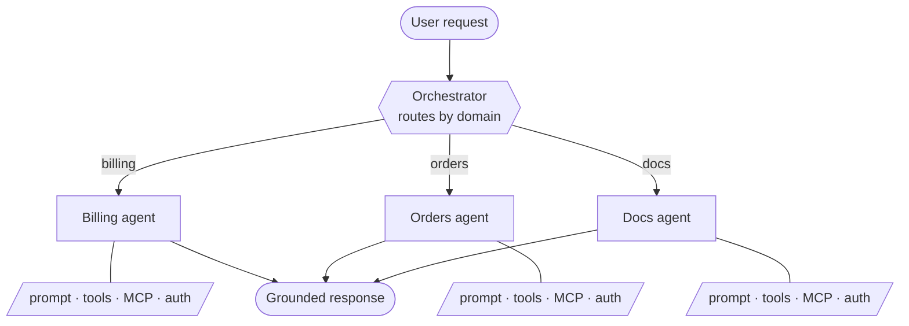

<p align="center">
  <picture>
    <source media="(prefers-color-scheme: dark)" srcset=".github/assets/logo-dark.svg">
    
  </picture>
</p>

<p align="center">
  <b>Turn your app into an agentic product — from one YAML file.</b><br>
  Give any application a smart, domain-aware agent layer, without
  building the engine yourself.
</p>

<p align="center">
  <a href="https://extra-c586718a.mintlify.site/docs/introduction"></a>
  
  <a href="LICENSE"></a>
</p>

<p align="center">
  <a href="https://extra-c586718a.mintlify.site/docs/introduction">Documentation</a> ·
  <a href="#quick-start">Quick Start</a> ·
  <a href="#how-it-works">How it works</a> ·
  <a href="#learn-more">Learn more</a> ·
  <a href="#contributing">Contributing</a>
</p>

---

## What Extra is

Extra is a lightweight engine that adds an agentic layer to any application.
You describe your agents in a simple YAML file — what each one is responsible
for and what it can access — and Extra turns that into a running system that
routes each request to the right agent and answers it accurately.

Every agent has a single, clear responsibility and is scoped to its own
domain, with its own prompt, tools, and data. That scoping is what keeps
answers grounded: a request about billing never reaches the returns agent, so
there's no context bleeding between domains and no hallucinated hand-off. You
get tools, MCP servers, authentication, provider connectors, and
observability out of the box — so your app can be agentic in a day, not a
quarter.

## How it works

You define a small graph in YAML: one **orchestrator** that routes, and
focused **agents** that do the work. Extra runs it — picking the right agent
per request and keeping each one inside its own domain.



Each agent only sees its own tools and data, so the model stays focused and
answers correctly for that part of your business. Add a new capability by
adding an agent to the file — no routing code to write.

Here's the same idea in YAML:

```yaml
orchestrators:
  router:
    description: "Routes each request to the right department."
    prompts:
      orchestrator: "prompts/router.md"

agents:
  orders_agent:
    description: "Handles order status and tracking."
    tools: [get_order_status]
    mcps: [orders_api]

  returns_agent:
    description: "Handles returns and refunds."
    tools: [create_return]

graph:
  router:
    orders_agent:
    returns_agent:
```

That's the whole system. Extra validates it, compiles it, and serves it as an
API. You only write your own business logic — the tool and connector stubs
Extra generates for you.

## Quick Start

Write your `agents.yml` (like the one above), then generate the plugin stubs
and serve it:

```bash
# Generate tool/resolver stubs from your spec, then fill in your logic
docker run --rm -v "$(pwd):/workspace" -w /workspace \
  ghcr.io/asaf-prog/extra:latest generate --config agents.yml

# Serve your system
docker run -p 8080:8080 -v "$(pwd):/workspace" -w /workspace \
  -e ANTHROPIC_API_KEY=sk-... \
  ghcr.io/asaf-prog/extra:latest serve --config agents.yml
```

Your agent API is live at `http://localhost:8080`. For the widget, local
(non-Docker) setup, and the full walkthrough, see the
[Quickstart docs](https://extra-c586718a.mintlify.site/docs/quickstart).

## What you get out of the box

- **Domain-focused agents** — one responsibility each, scoped to their own tools and data, so answers stay accurate.
- **Automatic routing** — declare the graph; Extra sends each request to the right agent.
- **Tools, MCP & auth** — connect any tool or MCP server, with tokens that never reach the model or the logs.
- **Observability** — a full trace of every request.

## Learn more

- **[Full example](https://extra-c586718a.mintlify.site/docs/tutorial)** — build a complete multi-agent system step by step.
- **[YAML reference](https://extra-c586718a.mintlify.site/docs/yaml-spec)** — every field you can declare.
- **[Architecture](https://extra-c586718a.mintlify.site/docs/architecture)** — how routing and execution work under the hood.

## Contributing

This repository is **agent-first** — if you're an AI coding agent, read
[AGENTS.md](AGENTS.md) before making changes. Human contributors should
start there too, then run `make check` before opening a PR.

## License

[MIT](LICENSE)
