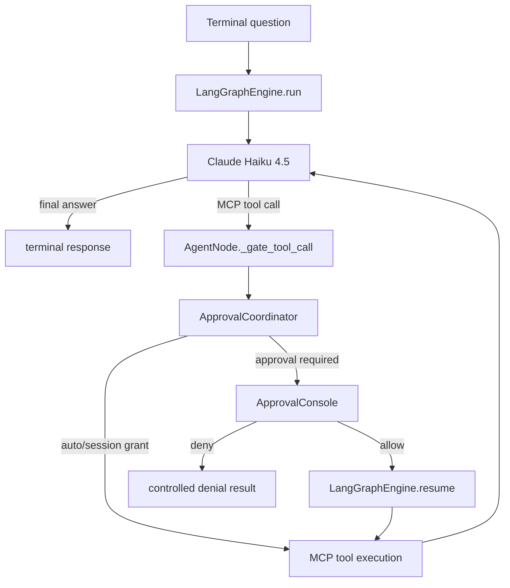

# Interactive MCP Control

This is a terminal application for manually exercising the production `extra` runtime with real
Claude, GitHub MCP, Context7 MCP, multi-turn in-memory history, and Human-in-the-Loop approval.
It never calls MCP tools directly: discovery and execution stay inside `LangGraphEngine`.



## Requirements

- Python environment with this repository's dependencies installed.
- `ANTHROPIC_API_KEY` for Claude Haiku 4.5.
- `CONTEXT7_API_KEY` for `https://mcp.context7.com/mcp`.
- `GITHUB_TOKEN` for GitHub's official remote MCP server at
  `https://api.githubcopilot.com/mcp/`.

Copy the placeholder file if desired, then fill it locally. `.env` is ignored by Git:

```bash
cp examples/interactive_mcp_control/.env.example examples/interactive_mcp_control/.env
```

Use a read-only or least-privilege GitHub token for normal testing. Tokens are read by MCP auth
plugins on each request and are never printed. Context7 uses the `CONTEXT7_API_KEY` header; GitHub
uses `Authorization: Bearer ...`.

## Run

From the repository root:

```bash
python3 examples/interactive_mcp_control/run.py
```

Detailed errors:

```bash
python3 examples/interactive_mcp_control/run.py --debug
```

Auto mode, which changes the real agent's YAML-derived `auto` value to true:

```bash
python3 examples/interactive_mcp_control/run.py --auto
```

The engine is built once, MCP tools are discovered once, one logical session ID is reused, and
connections/resources are released when the context manager exits. Terminal input runs through
`asyncio.to_thread`, so it does not block the async runtime.

## Commands

| Command | Behavior |
| --- | --- |
| `/help` | Show commands |
| `/tools` | Show actual discovered tools grouped by MCP server |
| `/history` | Show user/assistant messages and tool execution summaries |
| `/approvals` | List exact active session grants through the repository's public API |
| `/session` | Show safe current-session information |
| `/new-session` | Generate a new session ID with empty history and no matching grants |
| `/clear` | Clear current history only; approvals remain |
| `/clear-approvals` | Clear exact current-session grants |
| `/exit`, `/quit` | Exit cleanly |

## Approval behavior

- **Allow once** resumes only the exact pending invocation and is not stored.
- **Allow for this session** stores a grant for system, user, session, agent, provider/server, and
  tool identity. Another tool or server still asks separately.
- **Deny** never invokes the MCP provider; the denial is returned to Claude as a controlled tool
  result and the terminal remains active.
- **Auto mode** bypasses the approval provider and does not create session grants.

The terminal emits safe structured events for every approval decision:

```text
[SESSION CACHE] session_id=session-a tool=mcp:context7:query-docs source=session_cache hit=false
[APPROVAL DECISION] session_id=session-a tool=mcp:context7:query-docs decision=allow_for_session source=user
[APPROVAL STORED] session_id=session-a tool=mcp:context7:query-docs decision=allow_for_session
[TOOL EXECUTION] session_id=session-a tool=context7.query-docs executed=true phase=started
```

`APPROVAL STORED` is emitted by the injected repository after the grant is saved. It must appear
before `TOOL EXECUTION ... phase=started`, proving that the session permission is durable in the
current process before the MCP provider is invoked. Logs contain no tool arguments, headers,
tokens, or API-key values.

Arguments shown by `ApprovalConsole` are recursively sanitized without mutating the arguments sent
to the real provider. Authentication headers never enter approval arguments.

## History and sessions

Prior user and assistant messages are prepended using the same bounded-context pattern as
`ConversationService`. Tool names/statuses are retained for `/history`; the assistant response
contains the relevant tool result. Everything is process-local and is lost on restart.

`/clear` clears messages and tool-event summaries only. `/new-session` clears the previous
session's approval grants, selects a fresh history key and approval scope, and keeps the
already-built engine and discovered MCP tools.

## Manual session-approval proof

Run the app and use one MCP integration repeatedly:

1. Enter `Use Context7 to explain FastAPI dependency injection.`
2. For every Context7 tool requested on this first turn, choose `2` (allow for this session).
3. Enter the same question again. The matching tool calls print
   `source=session_cache hit=true` and execute without another approval prompt.
4. Request a different MCP tool (use `/tools` to see names). That tool prints `hit=false` and asks
   for its own approval.
5. Enter `/new-session`, then repeat the first question. The new session prints `hit=false` and
   asks again.
6. Choose `3` on any approval prompt to prove denial. The terminal prints `executed=false`, and no
   `phase=started` event appears for that request.

This flow stays inside the app's interactive `while` loop and calls MCP tools only through the
production `LangGraphEngine`.

## Safe questions

```text
Explain dependency injection without using tools.
Use Context7 to explain the current FastAPI dependency injection pattern.
Use Context7 to find LangGraph interrupt and resume documentation.
Use GitHub to list open issues in a repository I can access.
Use GitHub to read metadata for github/github-mcp-server.
```

Avoid write requests unless intentionally testing HITL with a suitably restricted account.

## Expected startup

```text
Interactive MCP Control App
[SESSION STARTED] session_id=session-a62c4e
Connected MCP servers:
- [CONNECTED] context7: 2 tools
- [CONNECTED] github: ... tools
```

If one server fails, it is shown as unavailable and the engine continues with tools from the other
server. A missing credential is named but its value is never shown.

## Known limitations and troubleshooting

- No `GITHUB_TOKEN`: GitHub is unavailable, while Context7 can continue.
- Context7 may transiently time out or stall; exit with Ctrl+C and restart. Completed connections
  have dynamically exposed `resolve-library-id` and `query-docs`.
- The in-memory checkpointer and approvals do not survive restart or work across replicas.
- History is bounded text context rather than a provider-native persistent message thread.
- The remote GitHub server can expose write tools depending on token/server configuration. HITL
  still protects every non-auto call, but a least-privilege token remains essential.
- `langfuse build failed` is non-fatal when optional observability credentials/configuration are
  unavailable.
